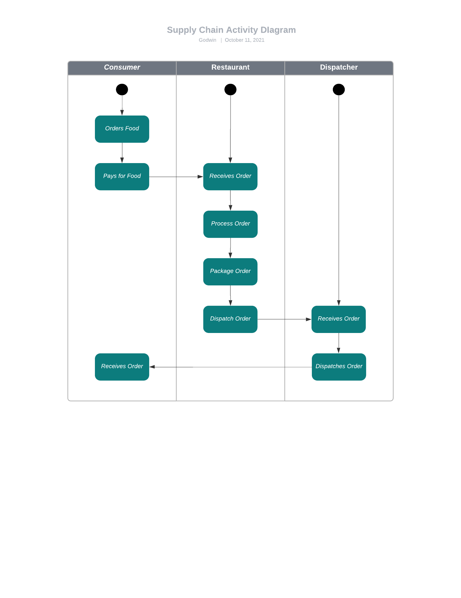
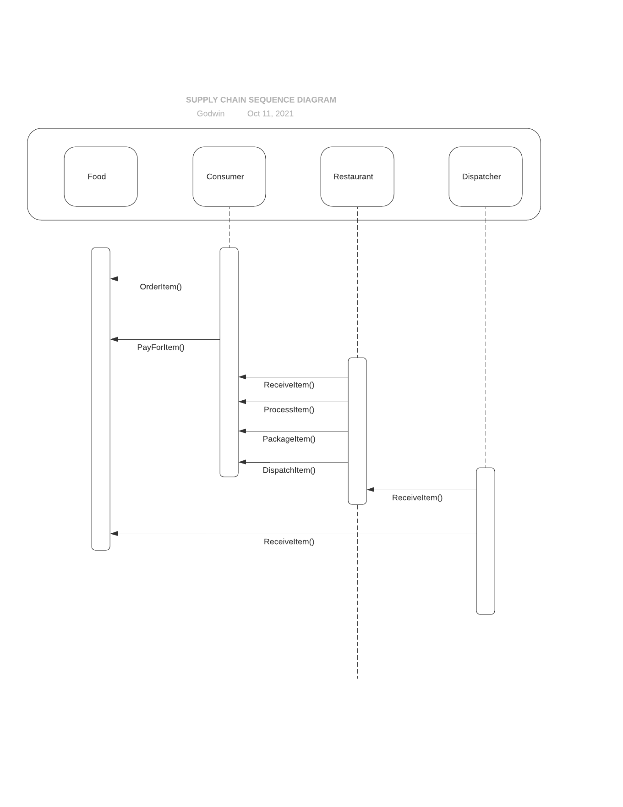
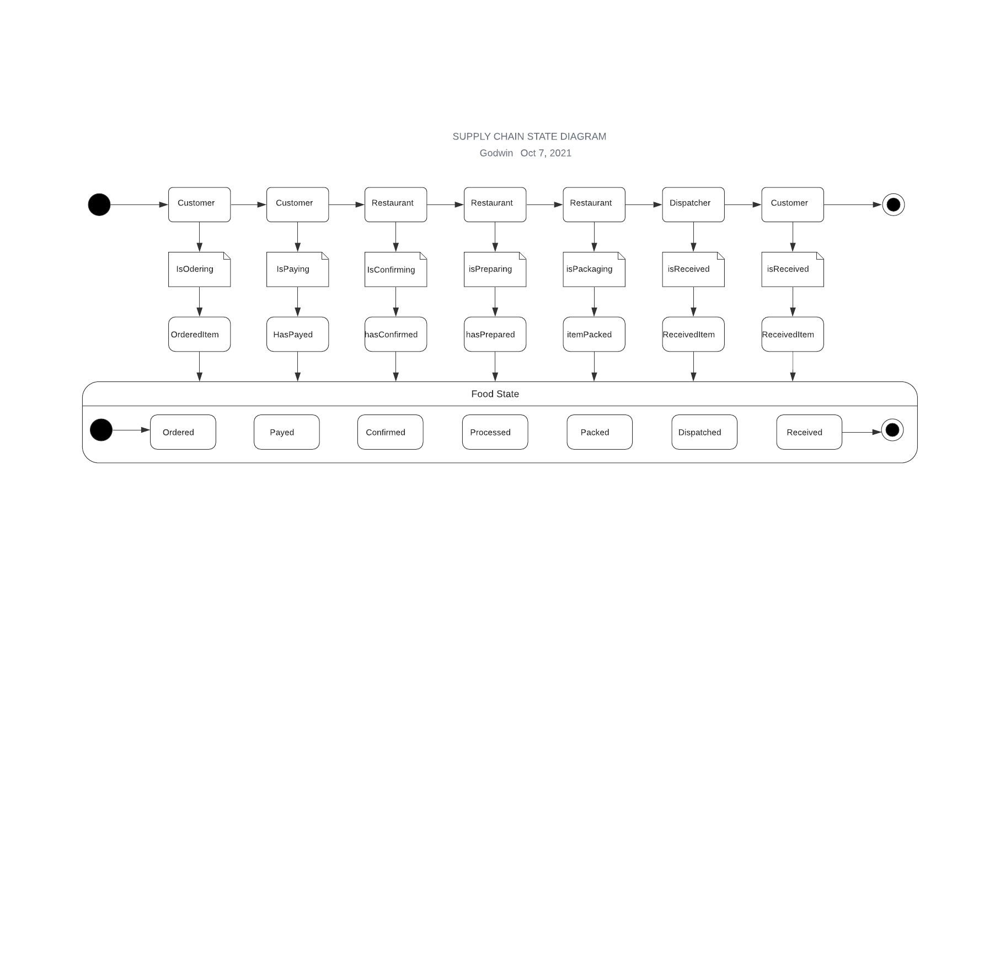
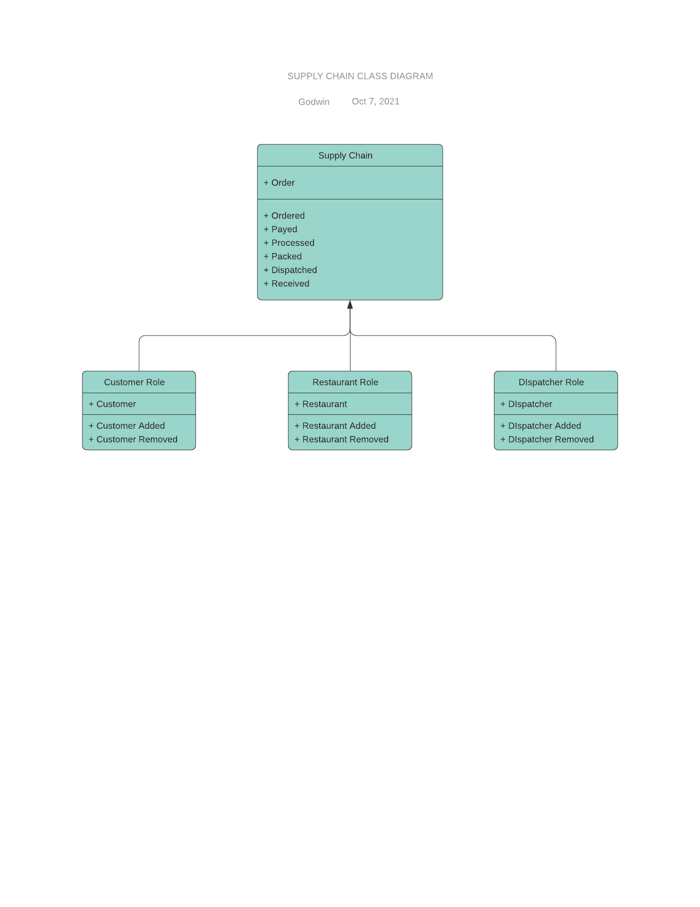

# blockchain-developer-bootcamp-final-project

## Project Description
The purpose of this project is to learn lower level components of establishing a sound web service architecture using Blockchain. 
In this project, I created a DAPP food delivery supply chain solution on Ethereum using smart contracts to track and verify a order authenticity.

## Project Workflow
1. Consumers register on the platform
2. Consumers will browse through the food items and make an order.
3. Consumers will make payment for their order.
4. Restaurants will confirm order and payments.
5. Restaurant will process order.
6. Restaurant will package order and give it to the dispatch rider.
6. Dispatch rider will confirm order and deliver to the consumer.
7. Consumer will confirm receiving order.


## UML Diagrams
I created UML activity, sequence, and state diagrams to showcase the development plan for the project.

#### Activity Diagram


#### Sequence Diagram


#### State Diagram


#### Classes (Data Model)



## Dependencies
To run the DApp in a local environment, the following dependencies are required:
* Node v14.10.0
  * download Node: https://nodejs.org/en/download/
* Truffle v5.4.10
  * Truffle: ``npm i -g truffle``
  * HDWallet provider:  ``npm i @truffle/hdwallet-provider``
  * Contract verification: ``npm i truffle-plugin-verify``
  * Ganache-cli: ``npm i ganache-cli``
* Openzeppelin contracts and libraries: ``npm i @openzeppelin/contracts``
* Front end 
  * React: ``npm i -g react``
  * React Error Boundary: ``npm i react-error-boundary``
* Web3
  * web3js: ``npm i -g web3``
  * ethers: ``npm i -g ethers``
  * Metamask: ``npm i @metamask/detect-provider``
  * Install metamask wallet in your browser
* Utils
  * .env file: ``npm i dotenv``

## Directory Structure
Key files and folders structures are as below:
```
FoodOrder Supply Chain (root)
+-- client
|   +-- public
|   +-- src
|       +-- abi
|       +-- components
|       +-- contexts
|       +-- utils
|    +-- App.j
|   +-- App.test.js
|   +-- index.js
|   +-- index.css
+-- contracts
|   +-- AccessControl
|       +-- consumerRole.sol
|       +-- DispatcherRole.sol
|       +-- RestaurantRole.sol
|        +-- Roles.sol
|    +-- Core
|        +-- Ownable.sol
|    +--SupplyChain.sol
+-- migrations
|   +-- 2_deploy_contracts.js 
|
+-- test
    +-- SupplyChain.test.js
+-- package.json
+-- truffle-config.js
```

## Front End
The front-end is built using React library with the necessary Hooks, components and deployed to web interface.

- The front-end includes the following:
    - Metamask wallet connect button
    - Display the wallet account balance
    - Allows user to submit deposit or withdraw tokens or ETH
-  Input validation to provide better user experience and avoid error fallback
-  Metamask connector can detect a change of network in your Metamask wallet and the web interface will issue a warning to the user that the app is only deployed on Rinkeby network


## Truffle Configuration
- truffle-config.js contains the network configuration for the following networks:
    - development
    - Rinkeby testnet

- HDwallet provider is required to connect to the Rinkeby testnet or Mainnet
    - install via npm i -g @truffle/hdwallet-provider
    - Seed phrase and network provider (Infura or Alchemy) details are stored locally in a config.env file. An example of such file is available - config.env.example
    - Due to abi residing in src folder, you have to modify the default truffle directory in truffle truffle-config.js
    ' contracts_build_directory: path.join(__dirname, '/client/src/abi'),'

## Deployed address and Verification
The contract is deployed and verified on Rinkeby testnet at 0x335410dFc0e59594a467D38fD7c10ad816531a8C

## Screencast
[Screencast](https://youtu.be/Mz9NCRcNW2Q)


## How to Interact with the DApp
There are 3 ways to interact with this DApp.
#### Interact through publicly deployed web interface
* Go to: https://tight-term-5317.on.fleek.co/
* If you do not have a Metamask browser extension, install Metamask in your browser. Connect your Metamask wallet and start interacting with the app.
#### Interact through local network
  * Download this folder 
  * Run ``cd blockchain-developer-bootcamp-final-project``
  * Run ``npm install`` to install all the dependencies in the ``package.json`` file
  * Launch the user interface via port: 3000 by running the following command in the ``client`` root directory
  ``npm run start``
  * Access the user interface via ``http://localhost:3000``
  * If you do not have Metamask browser extension, install Metamask in your browser. Connect your Metamask wallet and start interacting with the app.
  
#### Interact via Etherscan
  * You may also choose to interact with the dapp contract via [Etherscan Rinkeby.](https://rinkeby.etherscan.io/address/0x335410dFc0e59594a467D38fD7c10ad816531a8C)

Eth Address for NFT certificate

0xa8776ceed06AC0C5ECd40775f4D7121ABff2ed29
